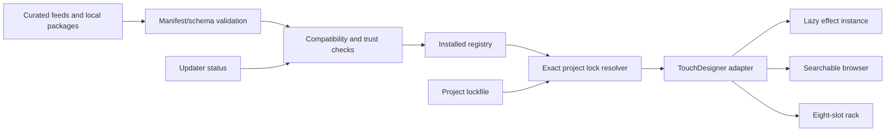
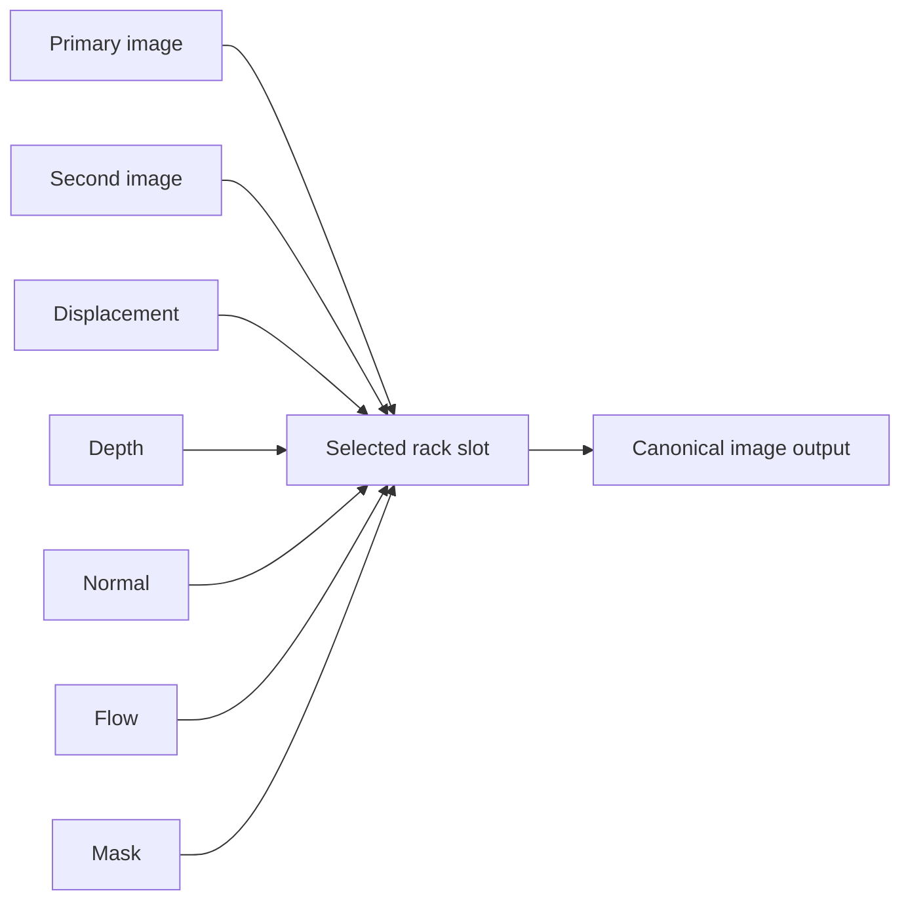

# Architecture

TD ImageFX Library separates visual content, runtime adaptation, discovery, installed state, and project decisions. That separation is the primary safeguard against an update changing a finished TouchDesigner show.

## Design principles

1. **Packages are immutable.** A published `<package-id>/<version>` is never edited in place.
2. **Identity is stable.** IDs use `tdimagefx.<category>.<effect>` and versions use Semantic Versioning.
3. **Contracts are explicit.** Inputs, image behavior, determinism, state, processing, provenance, assets, permissions, and compatibility are machine-readable.
4. **Discovery is not execution.** A feed entry can be displayed without downloading, installing, activating, or evaluating it.
5. **Projects decide.** The installed registry describes availability; an exact project lock describes production selection.
6. **TouchDesigner remains the renderer.** The library builds and connects operators, while shader compilation, image cooking, diagnostics, and GPU behavior remain visible in TouchDesigner.
7. **Failure is reversible.** Staging, side-by-side versions, activation records, and rollback preserve a last-known-good state.

## System layers

### Package layer

`packages/<package-id>/<version>/` holds one immutable package. `package.json` is its entry point. Declared assets may include GLSL, component source, presets, examples, previews, license text, or future platform-specific payloads. Undeclared executable assets do not become trusted merely because they are present in a directory.

The v0.3 source namespace contains **96 current effect IDs and 122 immutable version directories**. The 26 additional historical versions come from the twelve original v0.1 effects and the fourteen stateful effects that retain older packages beside their current `1.1.0` versions. Latest-version views contain:

| Processing model | Count |
| --- | ---: |
| `single_pass` | 68 |
| `multi_pass` | 14 |
| `temporal` | 10 |
| `simulation` | 4 |
| `adapter` | 0 |

The 96 current effects span 18 user-facing categories. Category describes the creative result; processing model describes graph shape. Neither is a trust level or performance guarantee.

### Contract layer

`schemas/` defines package, feed, installed-state, and project-lock boundaries. Three compatibility axes remain independent:

- `schema_version` controls metadata parsing and remains integer `1` in v0.3.
- `fx_api` controls adapter compatibility and remains `1.0`.
- Package `version` controls changes to one package and follows SemVer.

Schema-v1 additions are optional so immutable legacy packages remain readable. Absence means **legacy/unasserted**, not an inferred production promise. New v0.3 packages and all 14 stateful upgrades use the richer contracts.

#### Ports and routing

Input roles distinguish `source_image`, `second_image`, `auxiliary_image`, `transition_image`, `mask`, `depth`, `normal`, `flow`, `displacement`, and non-image control/data roles. Output roles distinguish `image`, `mask`, `state`, and `data`. Capabilities must agree with roles: for example, a `depth` input requires the `depth` capability, and a `second_image` requires `second_input`.

The rack maps image inputs to seven runtime paths:

Unknown or unsupported auxiliary roles fail with a diagnostic instead of being silently wired to the wrong texture.

#### Image contract

`image_contract` can declare:

| Section | Meaning |
| --- | --- |
| `color` | Input, working, and output spaces plus scene/display/data reference |
| `alpha` | Straight, premultiplied, opaque, none, or any representation at each stage |
| `pixel_format` | Inherit, minimum, preferred, or fixed format policy |
| `sampling` | Filter, edge behavior, mipmap use, and optional border color |

The validator cross-checks image metadata with top-level alpha policy. For example, a premultiplying effect must declare a premultiplied output.

#### Processing and state contract

Every current effect declares `processing.model`, relative `gpu_cost`, capabilities, ordered pass paths, and history requirements. v0.3 adds optional `pass_scale`, `iterations`, and exactly-one-default `quality_tiers`. No current v0.3 package publishes quality tiers yet; the contract exists for future implementations and must not be presented as measured performance.

Temporal and simulation packages can additionally declare:

- separate `state_pass` and `render_pass` paths;
- deterministic/fixed-step, seeded, time-dependent, external, or nondeterministic behavior;
- a pulse/toggle/automatic/unsupported reset strategy and reset target;
- reset behavior on resolution/input changes;
- warmup frames.

All 14 current stateful packages use separate private state and public render passes. The adapter stores the private state target in feedback/history, while only the render pass reaches the canonical display output. Reset clears all declared history nodes and can fall back to legacy private reset controls.

#### Provenance contract

`provenance` records whether content is original, adapted, ported, generated, or third-party; identifies source type, URL/revision/author/license when applicable; and may declare package-contained changelogs, examples, presets, and known limitations. Adapted, ported, and third-party content requires a source URL. Provenance does not replace license review.

### Core Python layer

`src/tdimagefx/` owns lifecycle logic that remains testable outside TouchDesigner:

| Module | Responsibility |
| --- | --- |
| `semver` | Parse and compare package versions and constraints |
| `manifest` | Load and validate package metadata and cross-field contracts |
| `registry` | Discover installed packages without changing project selection |
| `compatibility` | Evaluate TouchDesigner, OS, architecture, GPU/API, dependency, and effect API requirements |
| `lockfile` | Resolve and persist exact versions and digests |
| `feed` | Validate update indexes and select channel-appropriate candidates |
| `archive` | Verify identity/digests and safely stage archives |
| `state` | Persist installed, pending, active, and rollback state |
| `cli` | Expose core operations outside TouchDesigner |

Core modules do not import TouchDesigner's `td` module. This keeps schema, feed, archive, release, and lock behavior testable on Windows, macOS, and Linux.

### TouchDesigner adapter layer

`touchdesigner/` translates validated packages into operators and parameters. It is responsible for:

- creating or lazily loading a Base COMP for an exact package version;
- connecting primary and semantic auxiliary TOP inputs;
- constructing single-pass, multi-pass, temporal, and simulation graphs;
- allocating retained history, including histories longer than one frame;
- keeping state and render targets separate;
- creating parameters and binding shader uniforms;
- exposing one canonical TOP output and actionable shader diagnostics;
- attaching identity, version, contract, and compatibility metadata.

It does not decide that a package is trustworthy, publish an update, or rewrite a project lock.

### Presentation layer

The browser and rack consume catalog data without becoming package truth.

The browser supports text/category/tag/favorite filters plus channel, model, capability, input readiness, available-input, and sort controls. Its selected-effect view reports parameters, image contract, compatibility confidence, quality metadata, required buses, and preview path. Catalog components are loaded lazily.

The rack provides eight ordered slots; enable/mix/bypass; reset/reload; validated presets; modulation; automatic or manual time; and semantic second-image/displacement/depth/normal/flow/mask routing. Presets are UI/project state. They can retain exact versions but do not install packages, approve updates, or replace the project lock.

`InkFlowFusion.tox` and `ParticleRandomMove.tox` are separate reusable core
modules rather than immutable effect packages. Ink Flow Fusion combines two
single-pass minimal Chinese ink treatments with an optional seeded
water-current particle composite. Its whole module, visual treatment, and
particle layer each have explicit bypass controls. Particle Random Move
converts an image into deterministic seeded random-moving particles on the
GPU and returns its input unchanged when disabled. Neither module retains
feedback state.

The canonical demo routes source -> ink-flow module -> random-particle module
-> rack, then uses an explicit final switch for the rack. The three demo-level
bypasses and the two feature switches inside Ink Flow Fusion allow the stages
to be used independently or combined without rewiring.

### Update and release layer

The TouchDesigner updater is notification-only. It reads explicitly configured HTTPS or local feeds off the cook path, rejects duplicate JSON keys and oversized responses, binds source configuration to the feed ID and optional digest, applies channel hierarchy and runtime compatibility, reconciles cross-feed package collisions by exact project-lock source or configured trust, and reports one candidate per package with installed and locked context. It never downloads or activates a candidate.

`tools/package_release.py` builds a release transaction in a sibling staging directory. It validates all immutable versions, selects the latest 96, confines paths, emits deterministic ZIPs and the mixed-maturity `tdimagefx.github.catalog` feed, can bind the release tag to the source commit, and writes `release-provenance.json` plus `SHA256SUMS`. Only a complete transaction is exposed. Publication remains a separate human-controlled action.

## Source and generated artifacts

The source-first lifecycle is:

1. `tools/new_effect.py` creates a non-overwriting package scaffold with v0.3 contracts.
2. Authors review manifest, GLSL, provenance, limitations, inputs, and defaults.
3. `touchdesigner/scripts/build_project.py` runs inside TouchDesigner to validate all 122 manifests, select the latest 96, build native components/project, compile shaders, render previews, and capture benchmark samples.
4. Authors inspect the native build report and visual output, then record the approved environment and native-artifact hashes with `tools/record_native_validation.py`.
5. Gallery/baseline/benchmark tools regenerate and check derived documentation.
6. `tools/verify_repository.py` enforces counts, contracts, assets, native entrypoints, generated coverage, tests, feeds, and version consistency.
7. Release preparation produces a deterministic, reviewable, tag-pinned transaction.

For reproducibility, stateful gallery previews use a temporary static unroll of the declared state pass from controlled reset/prior-frame fixtures. This preview harness is deleted after capture and does not replace the black reset seed or live Feedback TOP graph stored in each versioned component.

The source catalog may be ahead of generated `.tox`, `.toe`, preview, baseline, and benchmark artifacts during development. That state is intentionally non-releasable: verification must fail until generated outputs are rebuilt and reviewed. The checked-in v0.3 source and generated artifacts are synchronized; the recorded TouchDesigner `2025.32820` build validates all 96 current effects and reports zero shader, preview, or builder errors.

## State boundaries

| State | Meaning | Mutability |
| --- | --- | --- |
| Source package | Published content at an exact version | Immutable |
| Installed registry | Verified packages available on a machine | Mutable machine state |
| Pending activation | Verified candidate awaiting approval/restart | Mutable machine state |
| Active selection | Version currently selected by a resolver | Mutable and auditable |
| Project lock | Exact versions and digests required by one project | Explicit migration only |
| Instance state | Parameters, modulation, presets, bypass/mix/manual time | Owned by the `.toe` project |

Discovery, installation, activation, project migration, and instance state must not collapse into one file or one implicit transition.

## Resolution and failure behavior

Resolution follows this order:

1. Read and validate the project lock when present.
2. Require each exact locked version and digest.
3. Activate only installed, compatible matches.
4. Report a reproducible missing/incompatible package instead of substituting the latest version.
5. Without a lock, resolve only from an explicitly selected channel and create a lock before production use.

Invalid manifests are excluded with actionable diagnostics. Unsupported schema/API versions fail closed. Digest or identity mismatches quarantine staging. GLSL failures keep bypass available when safe. Failed activation restores the prior pointer and never deletes the previous package.

## Extensibility

New content types implement the same four boundaries: manifest validation, compatibility evaluation, staging verification, and a TouchDesigner adapter. A compiled plugin can add restart, ABI, platform, signature, and license requirements without weakening the lifecycle used for GLSL packages.
