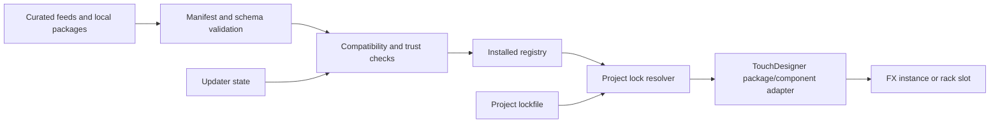

# Architecture

TD ImageFX Library separates reusable visual content from discovery, installation state, and project decisions. That separation is the main safeguard against an update changing a finished TouchDesigner project.

## Design principles

1. **Packages are immutable.** A published `<package-id>/<version>` is never edited in place.
2. **Identity is stable.** IDs use `tdimagefx.<category>.<effect>` and versions use Semantic Versioning.
3. **Contracts are explicit.** Manifest schema version, effect API version, inputs, parameters, assets, dependencies, and compatibility are machine-readable.
4. **Discovery is not execution.** A new feed entry can be displayed without downloading, installing, activating, or evaluating it.
5. **Projects decide.** The installed registry describes what is available; a project lock describes exactly what that project uses.
6. **TouchDesigner remains the renderer.** The library organizes effects and builds/integrates components; image cooking and shader compilation remain visible in TouchDesigner.
7. **Failure is reversible.** Staging, activation records, side-by-side versions, and rollback preserve the last known-good state.

## Layers

### Package layer

`packages/<package-id>/<version>/` holds one immutable package. `package.json` is its entry point. Assets may include GLSL, Python, component source, presets, previews, examples, license text, or platform-specific plugin payloads, but every shipped asset must be declared by the manifest and covered by the package digest policy.

The initial package namespace contains twelve GLSL effects across color, distortion, glitch, stylize, and transition categories. Future content types use the same lifecycle but may require stronger activation rules.

### Contract layer

`schemas/` defines the machine-readable boundaries for package manifests, feeds, installed state, and project locks. There are three independent compatibility axes:

- `schema_version` controls how metadata is parsed. The v0.1.0 value is integer `1`.
- `fx_api` controls whether a TouchDesigner adapter can expose and drive the effect. The v0.1.0 value is `1.0`.
- Package `version` controls changes to the package itself and follows SemVer.

A parser must reject unsupported schema versions. An adapter must refuse incompatible effect API versions. A resolver may retain several SemVer versions of one package simultaneously.

### Core Python layer

`src/tdimagefx/` owns data and lifecycle logic that can be tested independently of a `.toe` project:

| Module | Responsibility |
| --- | --- |
| `semver` | Parse and compare package versions and constraints |
| `manifest` | Load and validate package metadata |
| `registry` | Discover installed packages without conflating them with active project choices |
| `compatibility` | Evaluate TouchDesigner, OS, architecture, GPU/API, dependency, and effect API requirements |
| `lockfile` | Resolve and persist exact project versions and digests |
| `feed` | Read update indexes and select channel-appropriate candidates |
| `archive` | Verify and safely stage distributable archives |
| `state` | Persist installed, pending, active, and rollback state |
| `cli` | Expose the same core operations outside TouchDesigner |

Core modules must not import TouchDesigner's `td` module. This keeps schema, feed, archive, and lock behavior testable in ordinary Python and prevents updater logic from being coupled to a live show file.

### TouchDesigner adapter layer

`touchdesigner/` translates a validated package into TouchDesigner operators and parameters. Its responsibilities are deliberately narrow:

- create or load a Base COMP for an effect;
- connect image, mask, and auxiliary TOP inputs according to the manifest;
- create custom parameters from declared parameter metadata;
- bind parameters to GLSL uniforms or native nodes;
- expose one canonical TOP output;
- report shader compile errors and compatibility failures;
- attach package identity, version, digest, and lock status to the instance;
- preserve instance parameter values during a compatible, explicitly approved migration.

It does not decide that an update is trustworthy and does not rewrite a project lock on its own.

### Presentation layer

The eventual library browser and FX Rack are consumers of the registry and lock resolver. They should provide search, preview, categories, favorites, presets, reorderable slots, wet/dry mixing, modulation routing, performance estimates, and update status. Their UI state is not package truth; it can always be rebuilt from manifests, installed state, and the project lock.

## State boundaries

| State | Meaning | Mutability |
| --- | --- | --- |
| Source package | Published content at an exact version | Immutable |
| Installed registry | Packages verified and present on this machine | Mutable machine state |
| Pending activation | Verified candidate awaiting approval or restart | Mutable machine state |
| Active selection | Package currently selected by the resolver | Mutable, auditable |
| Project lock | Exact package versions and digests required by one project | Changes only through explicit project migration |
| Instance state | Effect parameters, modulation links, presets, bypass/mix | Owned by the `.toe` project |

Do not store all six concepts in one JSON file. In particular, discovering or installing a newer package must not alter the project lock.

## Package resolution

Resolution follows this order:

1. Read the project lock if one exists.
2. Require the exact locked version and digest.
3. If it is installed and compatible, activate it.
4. If it is missing, report a reproducible missing-package error and offer to retrieve that exact artifact.
5. If no lock exists, resolve only from an explicitly selected channel and produce a lock before the project is treated as production-ready.

No “latest wins” fallback is allowed for a locked project.

## Error behavior

- Invalid manifests are excluded from the registry with actionable validation messages.
- Unsupported `schema_version` or `fx_api` values fail closed.
- Missing assets or digest mismatches quarantine the package.
- GLSL compile errors leave the original input available through bypass and surface the GLSL TOP/Info DAT error.
- A failed activation restores the previous active pointer; it never deletes the previous version.
- A missing locked dependency is reported rather than silently substituted.

## Extensibility

New content types should implement four interfaces: manifest validation, compatibility evaluation, staging verification, and a TouchDesigner adapter. A new effect category does not require a new package lifecycle. A compiled plugin, however, can add restart, platform, ABI, signing, and license requirements without weakening the rules for simpler GLSL packages.
