# Effect gallery

This file is generated by `python tools/build_gallery.py`. Search `docs/gallery.json` programmatically or use this category index.

Current catalog: **96 effects** across **18 categories**.

GPU cost is a relative authoring hint; measure on the target GPU before a show.

## Blur

### Bilateral Blur

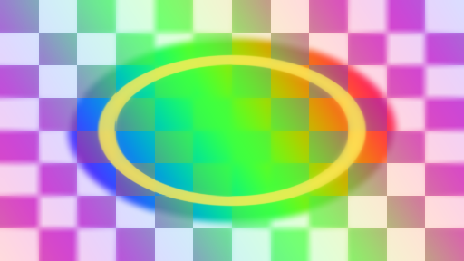

Applies a separable edge-aware bilateral blur using spatial and color-distance weights.

- Package: `tdimagefx.blur.bilateral-blur@1.0.0`
- Processing: `multi_pass` · GPU cost: `high`
- Capabilities: multi_pass
- Tags: blur, bilateral, edge-aware, denoise, multi-pass
- Inputs: 1 · Parameters: Enable, Mix, Radius, Spatial Sigma, Range Sigma

### Bokeh Blur

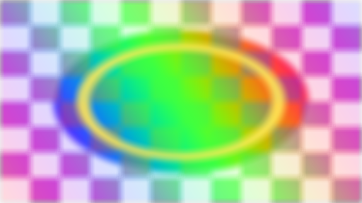

Creates a circular or polygonal bokeh blur with highlight weighting and deterministic sampling.

- Package: `tdimagefx.blur.bokeh-blur@1.0.0`
- Processing: `single_pass` · GPU cost: `high`
- Capabilities: none
- Tags: blur, bokeh, defocus, aperture, highlight
- Inputs: 1 · Parameters: Enable, Mix, Radius, Samples, Aperture Blades, Highlight Gain

### Box Blur

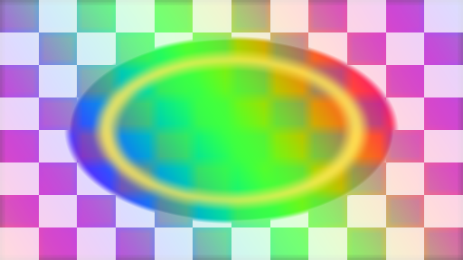

Applies a fast separable box blur with a controllable pixel radius.

- Package: `tdimagefx.blur.box-blur@1.0.0`
- Processing: `multi_pass` · GPU cost: `medium`
- Capabilities: multi_pass
- Tags: blur, box, fast, multi-pass
- Inputs: 1 · Parameters: Enable, Mix, Radius

### Chromatic Blur

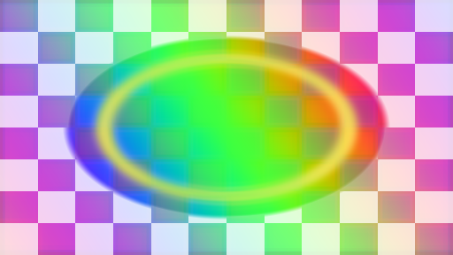

Blurs red, green, and blue at different separable radii for a soft chromatic fringe.

- Package: `tdimagefx.blur.chromatic-blur@1.0.0`
- Processing: `multi_pass` · GPU cost: `medium`
- Capabilities: multi_pass
- Tags: blur, chromatic, rgb, fringe, multi-pass
- Inputs: 1 · Parameters: Enable, Mix, Radius, Separation

### Depth Aware Blur

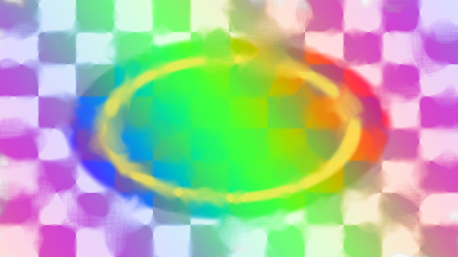

Applies depth-of-field blur using a depth-map focus plane and edge-aware sample rejection.

- Package: `tdimagefx.blur.depth-aware-blur@1.0.0`
- Processing: `single_pass` · GPU cost: `high`
- Capabilities: second_input, depth
- Tags: blur, depth, depth-of-field, focus, two-input
- Inputs: 2 · Parameters: Enable, Mix, Focus Depth, Aperture, Maximum Radius, Depth Edge Tolerance

### Directional Blur

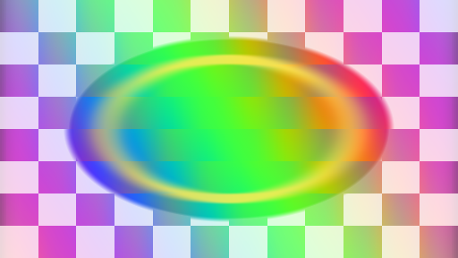

Builds a smooth linear motion blur through two directional sampling stages.

- Package: `tdimagefx.blur.directional-blur@1.0.0`
- Processing: `multi_pass` · GPU cost: `medium`
- Capabilities: multi_pass
- Tags: blur, directional, motion, multi-pass
- Inputs: 1 · Parameters: Enable, Mix, Distance, Angle

### Gaussian Blur

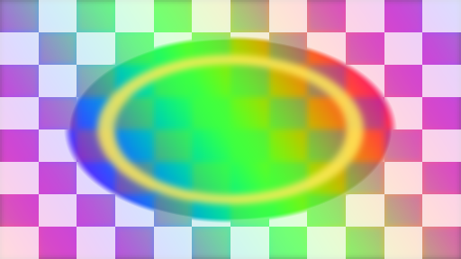

Applies a separable Gaussian blur with independent horizontal and vertical passes.

- Package: `tdimagefx.blur.gaussian-blur@1.0.0`
- Processing: `multi_pass` · GPU cost: `medium`
- Capabilities: multi_pass
- Tags: blur, gaussian, soften, multi-pass
- Inputs: 1 · Parameters: Enable, Mix, Radius

### Radial Blur

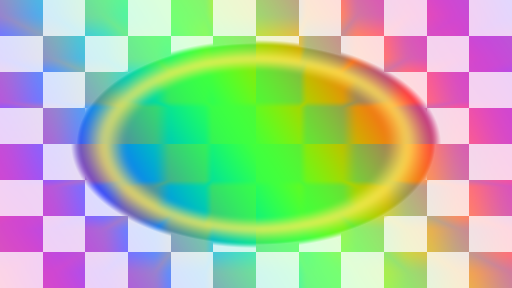

Creates a center-controlled zoom blur using two progressive radial integration passes.

- Package: `tdimagefx.blur.radial-blur@1.0.0`
- Processing: `multi_pass` · GPU cost: `high`
- Capabilities: multi_pass
- Tags: blur, radial, zoom, multi-pass
- Inputs: 1 · Parameters: Enable, Mix, Strength, Center X, Center Y

### Tilt Shift

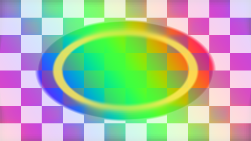

Keeps a horizontal focus band sharp while applying a separable variable-radius blur outside it.

- Package: `tdimagefx.blur.tilt-shift@1.0.0`
- Processing: `multi_pass` · GPU cost: `medium`
- Capabilities: multi_pass
- Tags: blur, tilt-shift, focus, miniature, multi-pass
- Inputs: 1 · Parameters: Enable, Mix, Radius, Focus, Band Width, Feather

## Color

### 3D LUT

Applies a trilinearly interpolated 3D color lookup table stored as a horizontal 2D strip.

- Package: `tdimagefx.color.lut-3d@1.0.0`
- Processing: `single_pass` · GPU cost: `medium`
- Capabilities: second_input
- Tags: color, lut, 3d-lut, grading, two-input
- Inputs: 2 · Parameters: Enable, Mix, LUT Size, Domain Minimum, Domain Maximum

### Channel Mixer

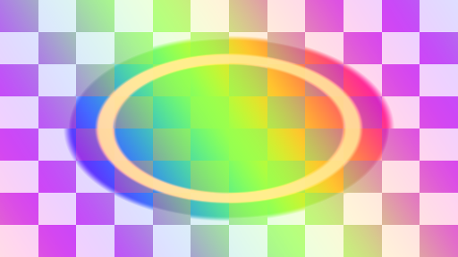

Recombines RGB input channels through a configurable three-by-three color matrix.

- Package: `tdimagefx.color.channel-mixer@1.0.0`
- Processing: `single_pass` · GPU cost: `low`
- Capabilities: none
- Tags: channels, matrix, color-transform, rgb
- Inputs: 1 · Parameters: Enable, Mix, Red from Red, Red from Green, Red from Blue, Green from Red, Green from Green, Green from Blue, Blue from Red, Blue from Green, Blue from Blue

### Color Decision List

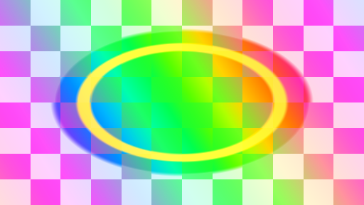

Applies ASC-CDL-style slope, offset, power, and saturation controls without silently changing color space.

- Package: `tdimagefx.color.color-decision-list@1.0.0`
- Processing: `single_pass` · GPU cost: `low`
- Capabilities: none
- Tags: color, cdl, grading, slope-offset-power, saturation
- Inputs: 1 · Parameters: Enable, Mix, Slope, Offset, Power, Saturation

### Curves

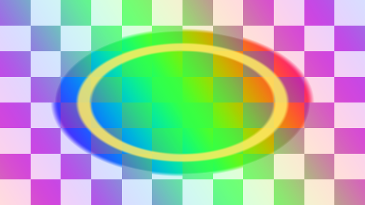

Applies independent cubic RGB tone curves with shadow and highlight control points.

- Package: `tdimagefx.color.curves@1.0.0`
- Processing: `single_pass` · GPU cost: `low`
- Capabilities: none
- Tags: color, curves, grading, rgb, tone
- Inputs: 1 · Parameters: Enable, Mix, Shadow Control, Highlight Control, Preserve Luma

### Duotone

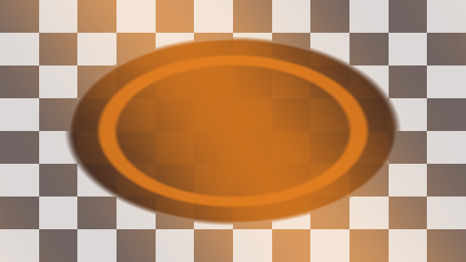

Maps image luminance between two configurable colors.

- Package: `tdimagefx.color.duotone@1.1.0`
- Processing: `single_pass` · GPU cost: `low`
- Capabilities: none
- Tags: grading, luminance, palette
- Inputs: 1 · Parameters: Enable, Mix, Shadow Color, Highlight Color, Contrast

### Exposure

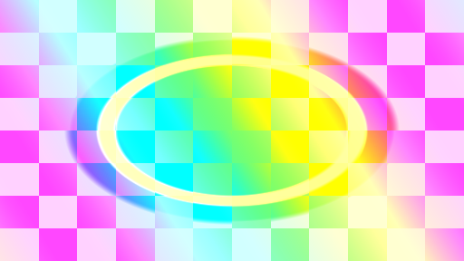

Adjusts exposure in photographic stops with offset and pivoted contrast controls.

- Package: `tdimagefx.color.exposure@1.0.0`
- Processing: `single_pass` · GPU cost: `low`
- Capabilities: none
- Tags: exposure, contrast, grading, photographic
- Inputs: 1 · Parameters: Enable, Mix, Exposure, Offset, Contrast, Pivot

### Gradient Map

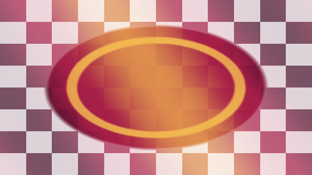

Maps image luminance across configurable shadow, midpoint, and highlight colors.

- Package: `tdimagefx.color.gradient-map@1.0.0`
- Processing: `single_pass` · GPU cost: `low`
- Capabilities: none
- Tags: gradient, palette, luminance, colorize
- Inputs: 1 · Parameters: Enable, Mix, Shadow Color, Mid Color, Highlight Color, Midpoint, Smoothness

### HSV Shift

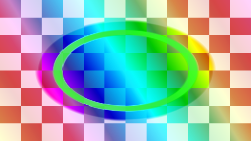

Animatable hue, saturation, and value adjustment in HSV color space.

- Package: `tdimagefx.color.hsv-shift@1.1.0`
- Processing: `single_pass` · GPU cost: `low`
- Capabilities: none
- Tags: hue, saturation, color-cycle
- Inputs: 1 · Parameters: Enable, Mix, Hue, Saturation, Value

### Levels

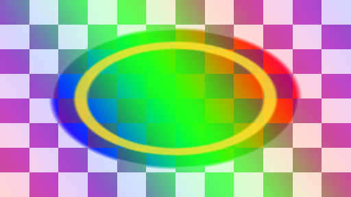

Remaps input black and white points through gamma into configurable output levels.

- Package: `tdimagefx.color.levels@1.0.0`
- Processing: `single_pass` · GPU cost: `low`
- Capabilities: none
- Tags: levels, gamma, black-point, white-point
- Inputs: 1 · Parameters: Enable, Mix, Input Black, Input White, Gamma, Output Black, Output White

### Lift Gamma Gain

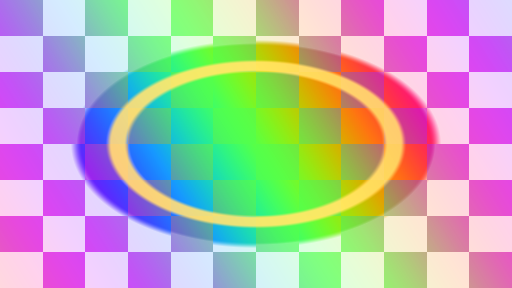

Provides independent RGB lift, gamma, and gain controls for primary color correction.

- Package: `tdimagefx.color.lift-gamma-gain@1.0.0`
- Processing: `single_pass` · GPU cost: `low`
- Capabilities: none
- Tags: lift, gamma, gain, primary-correction
- Inputs: 1 · Parameters: Enable, Mix, Lift R, Lift G, Lift B, Gamma R, Gamma G, Gamma B, Gain R, Gain G, Gain B

### Posterize

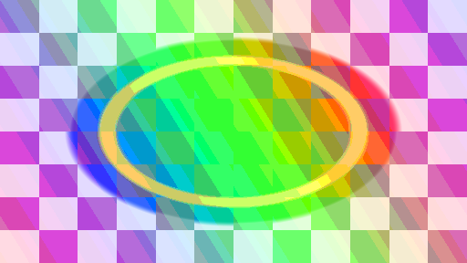

Quantizes RGB channels into a configurable number of color levels.

- Package: `tdimagefx.color.posterize@1.1.0`
- Processing: `single_pass` · GPU cost: `low`
- Capabilities: none
- Tags: quantize, graphic, color
- Inputs: 1 · Parameters: Enable, Mix, Levels, Gamma

### Temperature Tint

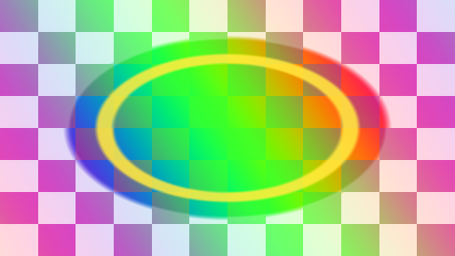

Balances warm-to-cool temperature and green-to-magenta tint while retaining luminance.

- Package: `tdimagefx.color.temperature-tint@1.0.0`
- Processing: `single_pass` · GPU cost: `low`
- Capabilities: none
- Tags: white-balance, temperature, tint, grading
- Inputs: 1 · Parameters: Enable, Mix, Temperature, Tint, Strength

### Tone Map

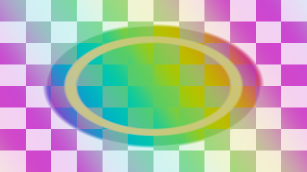

Maps scene-linear HDR values with Reinhard, ACES-fitted, or filmic curves in the incoming RGB primaries while preserving source alpha.

- Package: `tdimagefx.color.tone-map@1.0.0`
- Processing: `single_pass` · GPU cost: `low`
- Capabilities: none
- Tags: color, tone-map, hdr, aces, filmic
- Inputs: 1 · Parameters: Enable, Mix, Curve, Exposure, White Point

## Composite

### Alpha Composite

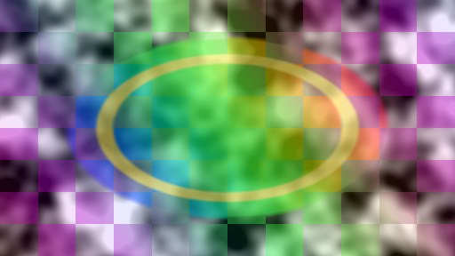

Composites a foreground over a background with straight or premultiplied foreground handling.

- Package: `tdimagefx.composite.alpha-composite@1.0.0`
- Processing: `single_pass` · GPU cost: `low`
- Capabilities: second_input
- Tags: composite, alpha, over, premultiply, two-input
- Inputs: 2 · Parameters: Enable, Mix, Foreground Opacity, Foreground Premultiplied

### Blend Modes

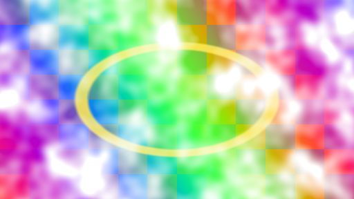

Combines two images with production-oriented normal, add, multiply, screen, overlay, soft-light, difference, and exclusion modes.

- Package: `tdimagefx.composite.blend-modes@1.0.0`
- Processing: `single_pass` · GPU cost: `low`
- Capabilities: second_input
- Tags: composite, blend, layer, two-input, alpha
- Inputs: 2 · Parameters: Enable, Mix, Blend Mode, Layer Opacity

### Channel Shuffle

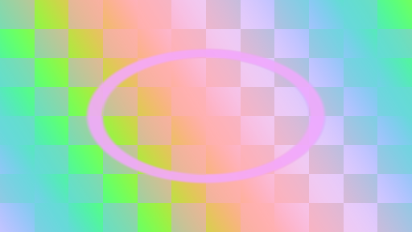

Reorders RGB channels and optionally derives alpha from source luminance.

- Package: `tdimagefx.composite.channel-shuffle@1.0.0`
- Processing: `single_pass` · GPU cost: `low`
- Capabilities: none
- Tags: composite, channels, shuffle, alpha, luminance
- Inputs: 1 · Parameters: Enable, Mix, RGB Order, Alpha From Luma, Monochrome

### Edge Extend

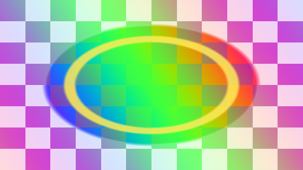

Extends opaque RGB into transparent pixels to reduce filtering fringes while preserving source alpha.

- Package: `tdimagefx.composite.edge-extend@1.0.0`
- Processing: `single_pass` · GPU cost: `medium`
- Capabilities: none
- Tags: composite, alpha, edge, extend, fringe
- Inputs: 1 · Parameters: Enable, Mix, Radius, Alpha Threshold

### Matte Composite

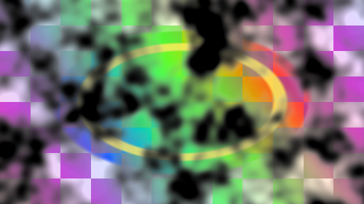

Composites foreground and background images through a dedicated matte input.

- Package: `tdimagefx.composite.matte-composite@1.0.0`
- Processing: `single_pass` · GPU cost: `low`
- Capabilities: second_input
- Tags: composite, matte, mask, three-input, alpha
- Inputs: 3 · Parameters: Enable, Mix, Matte Black Point, Matte White Point, Invert Matte

## Distortion

### Bulge Pinch

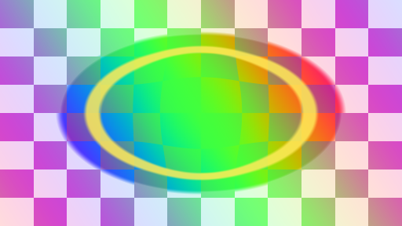

Creates a localized aspect-correct bulge or pinch around a configurable center and radius.

- Package: `tdimagefx.distort.bulge-pinch@1.0.0`
- Processing: `single_pass` · GPU cost: `low`
- Capabilities: none
- Tags: bulge, pinch, lens, localized
- Inputs: 1 · Parameters: Enable, Mix, Strength, Radius, Center X, Center Y

### Displacement Map

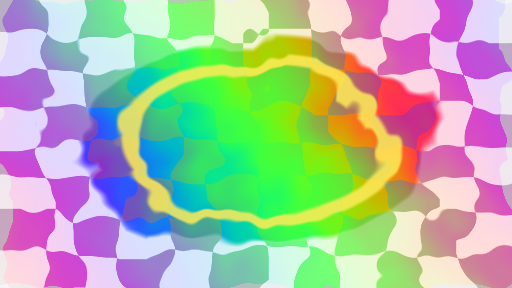

Offsets image sampling with the red and green channels of a second TOP.

- Package: `tdimagefx.distort.displacement-map@1.0.0`
- Processing: `single_pass` · GPU cost: `medium`
- Capabilities: second_input, displacement
- Tags: displacement, map, warp, two-input
- Inputs: 2 · Parameters: Enable, Mix, Amount X, Amount Y, Midpoint, Map Scale

### Flow Field Warp

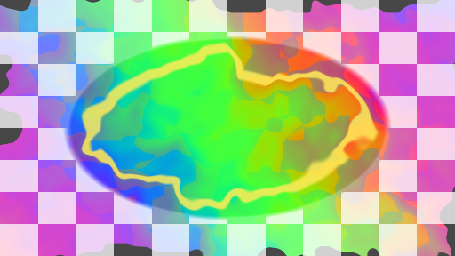

Warps the source with an external RG vector field; it does not compute the field.

- Package: `tdimagefx.distort.flow-field-warp@1.0.0`
- Processing: `single_pass` · GPU cost: `medium`
- Capabilities: second_input, flow, displacement
- Tags: flow, vector-field, warp, displacement
- Inputs: 2 · Parameters: Enable, Mix, Amount, Biasx, Biasy

### Kaleidoscope

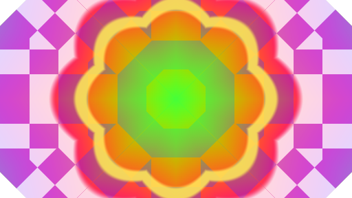

Reflects polar wedges to form an animatable kaleidoscope.

- Package: `tdimagefx.distort.kaleidoscope@1.1.0`
- Processing: `single_pass` · GPU cost: `medium`
- Capabilities: none
- Tags: mirror, polar, symmetry
- Inputs: 1 · Parameters: Enable, Mix, Segments, Rotation, Zoom

### Lens Distortion

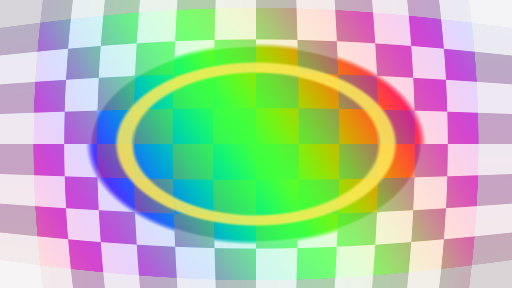

Applies aspect-correct barrel or pincushion lens distortion around a movable center.

- Package: `tdimagefx.distort.lens-distortion@1.0.0`
- Processing: `single_pass` · GPU cost: `low`
- Capabilities: none
- Tags: lens, barrel, pincushion, uv
- Inputs: 1 · Parameters: Enable, Mix, Amount, Zoom, Center X, Center Y

### Mirror

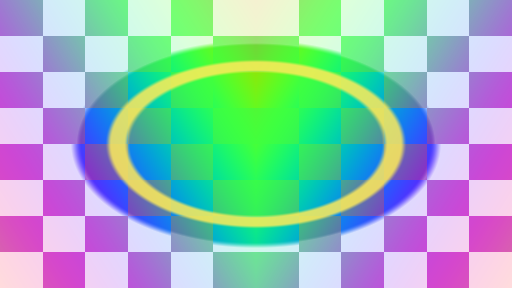

Folds either image axis across independently positioned mirror seams.

- Package: `tdimagefx.distort.mirror@1.0.0`
- Processing: `single_pass` · GPU cost: `low`
- Capabilities: none
- Tags: mirror, reflection, symmetry, fold
- Inputs: 1 · Parameters: Enable, Mix, Horizontal, Vertical, Seam X, Seam Y

### Polar Coordinates

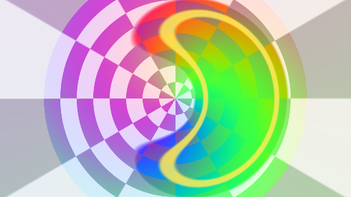

Remaps Cartesian output coordinates to angular and radial image coordinates.

- Package: `tdimagefx.distort.polar-coordinates@1.0.0`
- Processing: `single_pass` · GPU cost: `medium`
- Capabilities: none
- Tags: polar, radial, remap, uv
- Inputs: 1 · Parameters: Enable, Mix, Rotation, Radius Scale, Repeats, Center X, Center Y

### Ripple

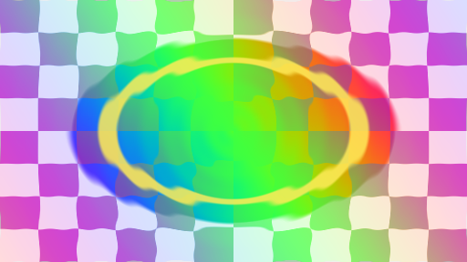

Animates concentric, decaying image ripples from a movable origin.

- Package: `tdimagefx.distort.ripple@1.0.0`
- Processing: `single_pass` · GPU cost: `medium`
- Capabilities: none
- Tags: ripple, water, radial, animated
- Inputs: 1 · Parameters: Enable, Mix, Time, Amount, Frequency, Speed, Decay, Center X, Center Y

### Twirl

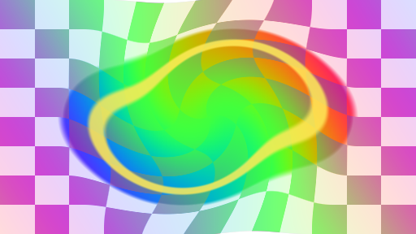

Rotates pixels around a configurable center with radial falloff.

- Package: `tdimagefx.distort.twirl@1.1.0`
- Processing: `single_pass` · GPU cost: `medium`
- Capabilities: none
- Tags: swirl, uv, lens
- Inputs: 1 · Parameters: Enable, Mix, Amount, Radius, Center X, Center Y

### Wave Warp

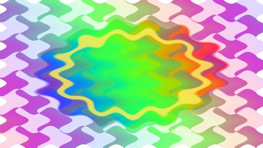

Applies animated sine-wave displacement along both image axes.

- Package: `tdimagefx.distort.wave-warp@1.1.0`
- Processing: `single_pass` · GPU cost: `medium`
- Capabilities: none
- Tags: wave, uv, animated
- Inputs: 1 · Parameters: Enable, Mix, Time, Amount, Frequency, Speed, Angle

## Glitch

### Block Shift

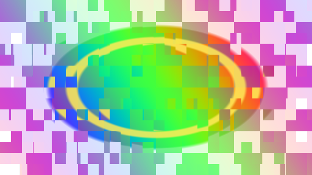

Animates deterministic horizontal offsets across randomized image blocks.

- Package: `tdimagefx.glitch.block-shift@1.1.0`
- Processing: `single_pass` · GPU cost: `low`
- Capabilities: none
- Tags: digital, blocks, animated
- Inputs: 1 · Parameters: Enable, Mix, Time, Amount, Block Size, Rate, Seed

### Digital Noise

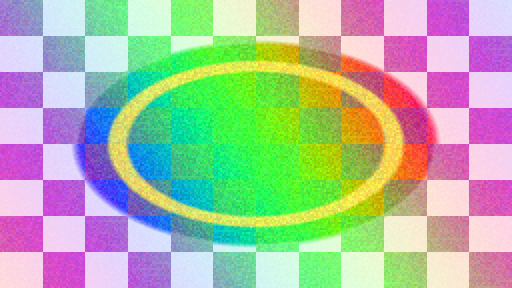

Adds seeded, frame-stepped monochrome or RGB digital noise at adjustable pixel sizes.

- Package: `tdimagefx.glitch.digital-noise@1.0.0`
- Processing: `single_pass` · GPU cost: `medium`
- Capabilities: none
- Tags: glitch, noise, grain, digital
- Inputs: 1 · Parameters: Enable, Mix, Time, Amount, Pixel Size, Rate, Monochrome, Seed

### RGB Split

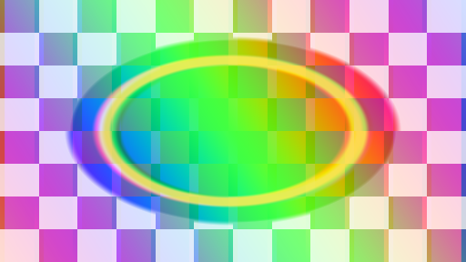

Offsets red, green, and blue samples in opposing directions.

- Package: `tdimagefx.glitch.rgb-split@1.1.0`
- Processing: `single_pass` · GPU cost: `low`
- Capabilities: none
- Tags: chromatic, aberration, glitch
- Inputs: 1 · Parameters: Enable, Mix, Amount, Angle, Green Offset

### Scan Tear

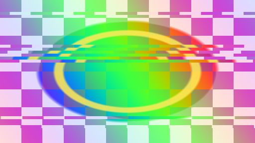

Produces frame-stepped horizontal tears across randomized scan bands.

- Package: `tdimagefx.glitch.scan-tear@1.0.0`
- Processing: `single_pass` · GPU cost: `low`
- Capabilities: none
- Tags: glitch, tear, scan, animated
- Inputs: 1 · Parameters: Enable, Mix, Time, Amount, Bands, Rate, Chance, Seed

### Slice Shift

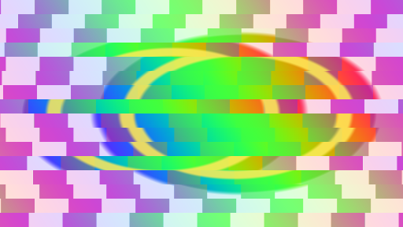

Slides alternating horizontal slices with independently phased animated offsets.

- Package: `tdimagefx.glitch.slice-shift@1.0.0`
- Processing: `single_pass` · GPU cost: `low`
- Capabilities: none
- Tags: glitch, slice, shift, animated
- Inputs: 1 · Parameters: Enable, Mix, Time, Amount, Slices, Speed, Stagger, Seed

## Key

### Chroma Key

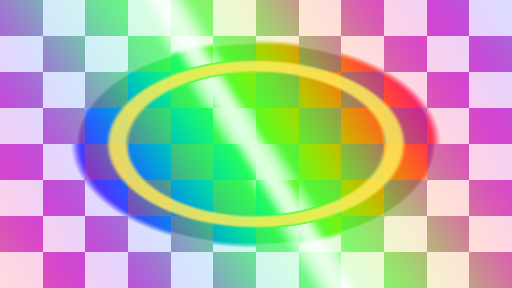

Builds an alpha matte from chroma distance in a luminance-separated color representation.

- Package: `tdimagefx.key.chroma-key@1.0.0`
- Processing: `single_pass` · GPU cost: `low`
- Capabilities: none
- Tags: key, chroma, green-screen, matte, alpha
- Inputs: 1 · Parameters: Enable, Mix, Key Color, Similarity, Softness, Clip Black, Clip White

### Despill

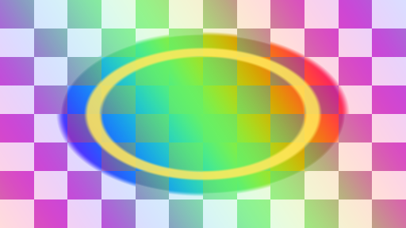

Suppresses a configurable screen-color component while retaining perceived luminance.

- Package: `tdimagefx.key.despill@1.0.0`
- Processing: `single_pass` · GPU cost: `low`
- Capabilities: none
- Tags: key, despill, green-screen, blue-screen, color
- Inputs: 1 · Parameters: Enable, Mix, Spill Color, Amount, Neutral Balance, Restore Luma

### Difference Key

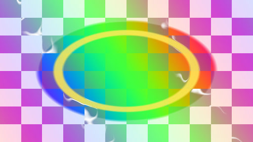

Creates an alpha matte from the color difference between a foreground and a clean reference plate.

- Package: `tdimagefx.key.difference-key@1.0.0`
- Processing: `single_pass` · GPU cost: `low`
- Capabilities: second_input
- Tags: key, difference, clean-plate, matte, two-input
- Inputs: 2 · Parameters: Enable, Mix, Difference Threshold, Softness, Luma Weight

### Luma Key

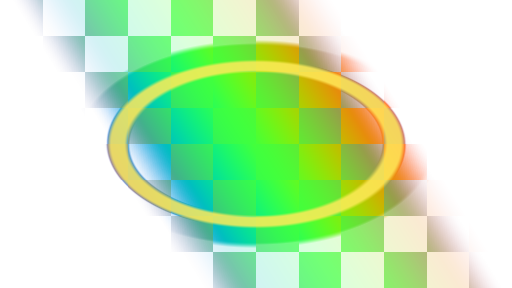

Creates alpha from luminance with high-key, low-key, softness, and inversion controls.

- Package: `tdimagefx.key.luma-key@1.0.0`
- Processing: `single_pass` · GPU cost: `low`
- Capabilities: none
- Tags: key, luma, matte, alpha, threshold
- Inputs: 1 · Parameters: Enable, Mix, Threshold, Softness, Keep Dark Values, Invert

## Light

### Bloom

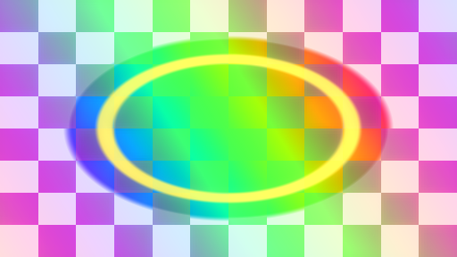

Extracts highlights, blurs them horizontally and vertically, then adds the result back as HDR bloom.

- Package: `tdimagefx.light.bloom@1.0.0`
- Processing: `multi_pass` · GPU cost: `high`
- Capabilities: multi_pass
- Tags: light, bloom, highlight, hdr, multi-pass
- Inputs: 1 · Parameters: Enable, Mix, Threshold, Soft Knee, Radius, Intensity

### Edge Glow

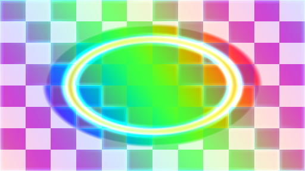

Detects luminance edges with a Sobel pass, softens the edge field, and adds a colored glow to the source.

- Package: `tdimagefx.light.edge-glow@1.0.0`
- Processing: `multi_pass` · GPU cost: `high`
- Capabilities: multi_pass
- Tags: light, edge, sobel, glow, multi-pass
- Inputs: 1 · Parameters: Enable, Mix, Edge Width, Threshold, Radius, Intensity, Glow Color

### Glow

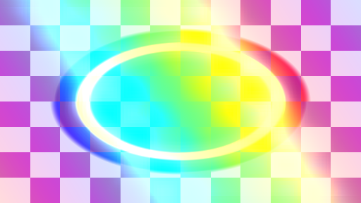

Extracts luminance into a user-tinted halo, spreads it in two stages, and composites it over the source.

- Package: `tdimagefx.light.glow@1.0.0`
- Processing: `multi_pass` · GPU cost: `high`
- Capabilities: multi_pass
- Tags: light, glow, halo, color, multi-pass
- Inputs: 1 · Parameters: Enable, Mix, Threshold, Spread, Intensity, Glow Color

## Lighting

### Normal Lighting

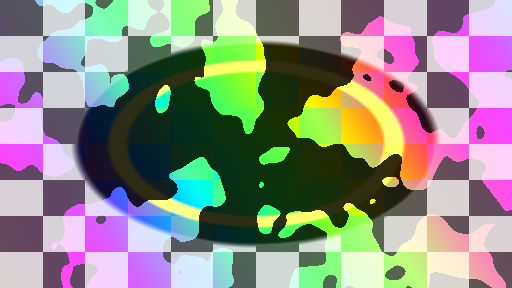

Lights an image with a supplied tangent-space normal map and adjustable light vector.

- Package: `tdimagefx.lighting.normal-lighting@1.0.0`
- Processing: `single_pass` · GPU cost: `low`
- Capabilities: second_input, normal
- Tags: normal, lighting, diffuse, relight
- Inputs: 2 · Parameters: Enable, Mix, Lightx, Lighty, Lightz, Ambient, Strength

## Mask

### Gradient Mask

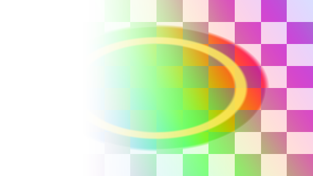

Applies a rotatable linear gradient to source alpha with position, width, softness, and inversion controls.

- Package: `tdimagefx.mask.gradient-mask@1.0.0`
- Processing: `single_pass` · GPU cost: `low`
- Capabilities: none
- Tags: mask, gradient, linear, alpha, generator
- Inputs: 1 · Parameters: Enable, Mix, Angle, Position, Width, Softness, Invert

### Noise Mask

Applies a deterministic animated fractal-noise mask to source alpha.

- Package: `tdimagefx.mask.noise-mask@1.0.0`
- Processing: `single_pass` · GPU cost: `medium`
- Capabilities: none
- Tags: mask, noise, animated, alpha, generator
- Inputs: 1 · Parameters: Enable, Mix, Scale, Threshold, Softness, Seed, Time, Speed, Invert

### Radial Mask

Applies an elliptical radial mask with independent center, size, feather, rotation, and inversion.

- Package: `tdimagefx.mask.radial-mask@1.0.0`
- Processing: `single_pass` · GPU cost: `low`
- Capabilities: none
- Tags: mask, radial, ellipse, alpha, generator
- Inputs: 1 · Parameters: Enable, Mix, Center, Size, Rotation, Feather, Invert

### Shape Mask

Applies a signed-distance rectangle-to-ellipse mask with adjustable roundness, rotation, and feather.

- Package: `tdimagefx.mask.shape-mask@1.0.0`
- Processing: `single_pass` · GPU cost: `low`
- Capabilities: none
- Tags: mask, shape, rectangle, ellipse, alpha
- Inputs: 1 · Parameters: Enable, Mix, Center, Size, Roundness, Rotation, Feather, Invert

## Matte

### Alpha Repair

Cleans hidden RGB, premultiplies, or safely unpremultiplies an RGBA image.

- Package: `tdimagefx.matte.alpha-repair@1.0.0`
- Processing: `single_pass` · GPU cost: `low`
- Capabilities: none
- Tags: matte, alpha, premultiply, unpremultiply, repair
- Inputs: 1 · Parameters: Enable, Mix, Mode, Alpha Threshold

### Matte Dilate

Expands alpha while borrowing RGB from the most opaque nearby sample to avoid dark fringes.

- Package: `tdimagefx.matte.dilate@1.0.0`
- Processing: `single_pass` · GPU cost: `medium`
- Capabilities: none
- Tags: matte, dilate, grow, alpha, morphology
- Inputs: 1 · Parameters: Enable, Mix, Radius

### Matte Erode

Contracts alpha with a circular minimum filter while retaining source RGB.

- Package: `tdimagefx.matte.erode@1.0.0`
- Processing: `single_pass` · GPU cost: `medium`
- Capabilities: none
- Tags: matte, erode, shrink, alpha, morphology
- Inputs: 1 · Parameters: Enable, Mix, Radius

### Matte Feather

Softens alpha with a separable two-pass Gaussian filter while preserving source RGB.

- Package: `tdimagefx.matte.feather@1.0.0`
- Processing: `multi_pass` · GPU cost: `medium`
- Capabilities: multi_pass
- Tags: matte, feather, blur, alpha, multi-pass
- Inputs: 1 · Parameters: Enable, Mix, Radius

## Motion

### Optical Flow Warp

Warps an image with a supplied optical-flow texture; flow estimation is intentionally external.

- Package: `tdimagefx.motion.optical-flow-warp@1.0.0`
- Processing: `single_pass` · GPU cost: `medium`
- Capabilities: second_input, flow, displacement
- Tags: optical-flow, motion, warp, external-input
- Inputs: 2 · Parameters: Enable, Mix, Scale, Confidence, Flipy

## Sharpen

### Sharpen

Enhances horizontal and vertical high-frequency detail in two separable sharpening passes.

- Package: `tdimagefx.sharpen.sharpen@1.0.0`
- Processing: `multi_pass` · GPU cost: `medium`
- Capabilities: multi_pass
- Tags: sharpen, detail, high-pass, multi-pass
- Inputs: 1 · Parameters: Enable, Mix, Amount

### Unsharp Mask

Builds a separable Gaussian reference and adds thresholded high-frequency detail back to the source.

- Package: `tdimagefx.sharpen.unsharp-mask@1.0.0`
- Processing: `multi_pass` · GPU cost: `high`
- Capabilities: multi_pass
- Tags: sharpen, unsharp-mask, detail, multi-pass
- Inputs: 1 · Parameters: Enable, Mix, Radius, Amount, Threshold

## Simulation

### Cellular Automata

Evolves a smooth Life-like cellular field with source-driven seeding.

- Package: `tdimagefx.simulation.cellular-automata@1.1.0`
- Processing: `simulation` · GPU cost: `high`
- Capabilities: history, simulation
- Tags: cellular, automata, life, simulation
- Inputs: 1 · Parameters: Enable, Mix, Reset State, Birth, Survival, Seed

### Fluid Ink

Advects accumulated color through a procedural curl field with source-driven ink injection.

- Package: `tdimagefx.simulation.fluid-ink@1.1.0`
- Processing: `simulation` · GPU cost: `high`
- Capabilities: history, simulation
- Tags: fluid, ink, advection, simulation
- Inputs: 1 · Parameters: Enable, Mix, Reset State, Advection, Decay, Injection, Phase

### Particle Advection

Advects bright source particles through a procedural vector field with persistent trails.

- Package: `tdimagefx.simulation.particle-advection@1.1.0`
- Processing: `simulation` · GPU cost: `high`
- Capabilities: history, simulation
- Tags: particle, advection, flow, simulation
- Inputs: 1 · Parameters: Enable, Mix, Reset State, Speed, Decay, Threshold, Phase

### Reaction Diffusion

Advances a Gray-Scott reaction-diffusion state seeded by source luminance.

- Package: `tdimagefx.simulation.reaction-diffusion@1.1.0`
- Processing: `simulation` · GPU cost: `high`
- Capabilities: history, simulation
- Tags: reaction-diffusion, gray-scott, generative, simulation
- Inputs: 1 · Parameters: Enable, Mix, Reset State, Feed, Kill, Diffusion, Seed

## Spatial

### Depth Parallax

Offsets source pixels with a supplied depth map to simulate a movable viewpoint.

- Package: `tdimagefx.spatial.depth-parallax@1.0.0`
- Processing: `single_pass` · GPU cost: `medium`
- Capabilities: second_input, depth, displacement
- Tags: depth, parallax, view, spatial
- Inputs: 2 · Parameters: Enable, Mix, Amount, Viewx, Viewy, Depthcenter

## Stylize

### Edge Detect

Extracts adjustable Sobel-style luminance edges with monochrome and source-color modes.

- Package: `tdimagefx.stylize.edge-detect@1.0.0`
- Processing: `single_pass` · GPU cost: `medium`
- Capabilities: none
- Tags: edges, sobel, outline, contour
- Inputs: 1 · Parameters: Enable, Mix, Radius, Strength, Threshold, Softness, Invert, Color Amount

### Emboss

Creates directional raised and recessed relief from opposing image samples.

- Package: `tdimagefx.stylize.emboss@1.0.0`
- Processing: `single_pass` · GPU cost: `low`
- Capabilities: none
- Tags: relief, directional, carve, texture
- Inputs: 1 · Parameters: Enable, Mix, Angle, Distance, Strength, Bias, Color Amount

### Frosted Glass

Refracts the image with deterministic cell noise, then softens the displaced result like textured glass.

- Package: `tdimagefx.stylize.frosted-glass@1.0.0`
- Processing: `multi_pass` · GPU cost: `medium`
- Capabilities: multi_pass
- Tags: stylize, glass, frosted, refraction, multi-pass
- Inputs: 1 · Parameters: Enable, Mix, Scale, Distortion, Softness, Seed

### Halftone

Renders luminance as an angle-adjustable field of print-style halftone dots.

- Package: `tdimagefx.stylize.halftone@1.0.0`
- Processing: `single_pass` · GPU cost: `low`
- Capabilities: none
- Tags: print, dots, comic, screening
- Inputs: 1 · Parameters: Enable, Mix, Cell Size, Angle, Dot Size, Softness, Monochrome

### Ordered Dither

Quantizes color with a scalable four-by-four ordered threshold pattern.

- Package: `tdimagefx.stylize.ordered-dither@1.0.0`
- Processing: `single_pass` · GPU cost: `low`
- Capabilities: none
- Tags: dither, quantize, pixel-art, bayer
- Inputs: 1 · Parameters: Enable, Mix, Levels, Pattern Scale, Strength

### Pixelate

Reduces apparent image resolution into adjustable pixel blocks.

- Package: `tdimagefx.stylize.pixelate@1.1.0`
- Processing: `single_pass` · GPU cost: `low`
- Capabilities: none
- Tags: pixel, mosaic, low-resolution
- Inputs: 1 · Parameters: Enable, Mix, Pixel Size

### Scanlines

Adds animated CRT-style scanlines, flicker, and subtle RGB grille separation.

- Package: `tdimagefx.stylize.scanlines@1.1.0`
- Processing: `single_pass` · GPU cost: `low`
- Capabilities: none
- Tags: crt, retro, display
- Inputs: 1 · Parameters: Enable, Mix, Time, Density, Strength, Speed

### Sepia

Builds a controllable warm sepia palette from luminance and retained source chroma.

- Package: `tdimagefx.stylize.sepia@1.0.0`
- Processing: `single_pass` · GPU cost: `low`
- Capabilities: none
- Tags: vintage, warm, monochrome, photographic
- Inputs: 1 · Parameters: Enable, Mix, Warmth, Fade, Contrast, Paper

### VHS

Combines animated line jitter, chroma delay, scanlines, noise, and tracking distortion.

- Package: `tdimagefx.stylize.vhs@1.0.0`
- Processing: `single_pass` · GPU cost: `medium`
- Capabilities: none
- Tags: analog, tape, scanlines, glitch, animated
- Inputs: 1 · Parameters: Enable, Mix, Time, Jitter, Jitter Rate, Chroma Delay, Scanline Strength, Noise, Tracking

### Vignette

Darkens or colors image edges with adjustable roundness and softness.

- Package: `tdimagefx.stylize.vignette@1.1.0`
- Processing: `single_pass` · GPU cost: `low`
- Capabilities: none
- Tags: lens, edge, cinematic
- Inputs: 1 · Parameters: Enable, Mix, Amount, Softness, Roundness, Color

## Temporal

### Echo

Layers a displaced, color-tinted echo from the previous frame behind the source.

- Package: `tdimagefx.temporal.echo@1.1.0`
- Processing: `temporal` · GPU cost: `medium`
- Capabilities: history
- Tags: echo, delay, color, history
- Inputs: 1 · Parameters: Enable, Mix, Reset State, Feedback, Offsetx, Offsety, Tint

### Feedback Kaleidoscope

Folds recursive feedback into mirrored radial segments.

- Package: `tdimagefx.temporal.feedback-kaleidoscope@1.1.0`
- Processing: `temporal` · GPU cost: `medium`
- Capabilities: history
- Tags: feedback, kaleidoscope, mirror, history
- Inputs: 1 · Parameters: Enable, Mix, Reset State, Segments, Zoom, Feedback

### Feedback Rotate

Rotates and scales the prior frame before recursively blending it into the source.

- Package: `tdimagefx.temporal.feedback-rotate@1.1.0`
- Processing: `temporal` · GPU cost: `medium`
- Capabilities: history
- Tags: feedback, rotate, spiral, history
- Inputs: 1 · Parameters: Enable, Mix, Reset State, Angle, Scale, Feedback

### Feedback Trails

Accumulates luminous trails from prior frames with controllable drift and decay.

- Package: `tdimagefx.temporal.feedback-trails@1.1.0`
- Processing: `temporal` · GPU cost: `medium`
- Capabilities: history
- Tags: feedback, trails, echo, history
- Inputs: 1 · Parameters: Enable, Mix, Reset State, Feedback, Decay, Offsetx, Offsety

### Frame Blend

Blends the current image with accumulated history for temporal smoothing.

- Package: `tdimagefx.temporal.frame-blend@1.1.0`
- Processing: `temporal` · GPU cost: `low`
- Capabilities: history
- Tags: blend, smoothing, history, temporal
- Inputs: 1 · Parameters: Enable, Mix, Reset State, History

### Motion Smear

Samples feedback along a controllable vector to create directional temporal smearing.

- Package: `tdimagefx.temporal.motion-smear@1.1.0`
- Processing: `temporal` · GPU cost: `high`
- Capabilities: history
- Tags: motion, smear, directional, history
- Inputs: 1 · Parameters: Enable, Mix, Reset State, Distance, Angle, Feedback

### Recursive Zoom

Recursively zooms feedback around a movable center to form tunnel trails.

- Package: `tdimagefx.temporal.recursive-zoom@1.1.0`
- Processing: `temporal` · GPU cost: `medium`
- Capabilities: history
- Tags: feedback, zoom, tunnel, history
- Inputs: 1 · Parameters: Enable, Mix, Reset State, Zoom, Feedback, Centerx, Centery

### Stutter

Freezes feedback state on demand for rhythmic frame-hold effects.

- Package: `tdimagefx.temporal.stutter@1.1.0`
- Processing: `temporal` · GPU cost: `low`
- Capabilities: history
- Tags: stutter, freeze, hold, history
- Inputs: 1 · Parameters: Enable, Mix, Reset State, Hold

### Temporal Glitch

Replaces randomized image blocks with offset history for controllable digital dropouts.

- Package: `tdimagefx.temporal.temporal-glitch@1.1.0`
- Processing: `temporal` · GPU cost: `medium`
- Capabilities: history
- Tags: glitch, blocks, dropout, history
- Inputs: 1 · Parameters: Enable, Mix, Reset State, Amount, Blocksize, Phase

### Time Displacement

Selects current or historical pixels from a luminance-driven temporal mask.

- Package: `tdimagefx.temporal.time-displacement@1.1.0`
- Processing: `temporal` · GPU cost: `medium`
- Capabilities: history, displacement
- Tags: time, displacement, luminance, history
- Inputs: 1 · Parameters: Enable, Mix, Reset State, Amount, Phase, Softness

## Transform

### Corner Pin

Samples a user-defined source quadrilateral for corner-pin and projection-alignment workflows.

- Package: `tdimagefx.transform.corner-pin@1.0.0`
- Processing: `single_pass` · GPU cost: `low`
- Capabilities: none
- Tags: transform, corner-pin, quad, projection, uv
- Inputs: 1 · Parameters: Enable, Mix, Bottom Left, Bottom Right, Top Left, Top Right

### Crop Feather

Crops each image edge independently and optionally feathers the resulting alpha boundary.

- Package: `tdimagefx.transform.crop-feather@1.0.0`
- Processing: `single_pass` · GPU cost: `low`
- Capabilities: none
- Tags: transform, crop, feather, alpha, framing
- Inputs: 1 · Parameters: Enable, Mix, Left, Right, Bottom, Top, Feather

### Fit Fill

Fits or fills an image inside a configurable frame aspect with alignment and background color controls.

- Package: `tdimagefx.transform.fit-fill@1.0.0`
- Processing: `single_pass` · GPU cost: `low`
- Capabilities: none
- Tags: transform, fit, fill, aspect, framing
- Inputs: 1 · Parameters: Enable, Mix, Frame Aspect, Mode, Alignment, Background

### Perspective Warp

Applies a controllable projective tilt around horizontal and vertical axes with center and zoom controls.

- Package: `tdimagefx.transform.perspective-warp@1.0.0`
- Processing: `single_pass` · GPU cost: `low`
- Capabilities: none
- Tags: transform, perspective, projective, tilt, uv
- Inputs: 1 · Parameters: Enable, Mix, Horizontal Tilt, Vertical Tilt, Perspective, Zoom, Center

### Tile Repeat

Tiles, offsets, rotates, and optionally mirrors repeated copies of an image.

- Package: `tdimagefx.transform.tile-repeat@1.0.0`
- Processing: `single_pass` · GPU cost: `low`
- Capabilities: none
- Tags: transform, tile, repeat, mirror, pattern
- Inputs: 1 · Parameters: Enable, Mix, Tiles, Offset, Rotation, Mirror Alternate Tiles

### Transform 2D

Applies pivoted translation, rotation, and non-uniform scale with optional repeated edges.

- Package: `tdimagefx.transform.transform-2d@1.0.0`
- Processing: `single_pass` · GPU cost: `low`
- Capabilities: none
- Tags: transform, translate, rotate, scale, pivot, uv
- Inputs: 1 · Parameters: Enable, Mix, Translate, Scale, Rotation, Pivot, Repeat Outside

## Transition

### Directional Wipe

Wipes between two images along an arbitrary angle with a controllable soft edge.

- Package: `tdimagefx.transition.directional-wipe@1.0.0`
- Processing: `single_pass` · GPU cost: `low`
- Capabilities: second_input, transition
- Tags: transition, directional, wipe, two-input
- Inputs: 2 · Parameters: Enable, Mix, Progress, Softness, Angle, Reverse

### Luma Wipe

Reveals a second image according to the luminance structure of the first image.

- Package: `tdimagefx.transition.luma-wipe@1.0.0`
- Processing: `single_pass` · GPU cost: `low`
- Capabilities: second_input, transition
- Tags: transition, luma, wipe, two-input
- Inputs: 2 · Parameters: Enable, Mix, Progress, Softness, Luma Bias, Invert

### Noise Dissolve

Transitions between two images through a seeded procedural noise field.

- Package: `tdimagefx.transition.noise-dissolve@1.1.0`
- Processing: `single_pass` · GPU cost: `medium`
- Capabilities: second_input, transition
- Tags: transition, noise, dissolve
- Inputs: 2 · Parameters: Enable, Mix, Progress, Softness, Scale, Seed

### Radial Wipe

Expands or contracts a circular transition around a movable, aspect-correct center.

- Package: `tdimagefx.transition.radial-wipe@1.0.0`
- Processing: `single_pass` · GPU cost: `low`
- Capabilities: second_input, transition
- Tags: transition, radial, circle, two-input
- Inputs: 2 · Parameters: Enable, Mix, Progress, Softness, Center X, Center Y, Reverse
