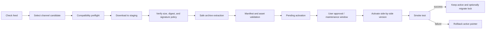

# Updater, security, and version locking

The updater is a package discovery and lifecycle system, not an unrestricted internet installer. Its safest useful default is **automatic periodic checks, notification-only activation**.

In v0.1.0, the TouchDesigner updater implements the notify-only slice: it reads enabled `https` or local `file` feeds on a worker thread, compares available releases with the manifests under `packages/`, and writes results to `.imagefx/update-status.json` for display on TouchDesigner's main thread. It does not download or activate packages. The later lifecycle stages documented below are the required design for future releases, not permission to assume that v0.1.0 performs them.

## Update modes

| Mode | Network check | Download | Activation | Recommended use |
| --- | --- | --- | --- | --- |
| Off/manual | Only on command | Only on command | Explicit | Air-gapped shows |
| Notify only | Scheduled | Explicit | Explicit | Default for most users |
| Download and stage | Scheduled | Automatic for trusted feeds | Explicit | Studio workstations |
| Automatic activation | Scheduled | Automatic | Policy-controlled | Only signed, low-risk, backward-compatible content outside live shows |

Compiled plugins, Python packages, and packages requesting new capabilities must never inherit automatic activation merely because a GLSL-only package was trusted.

## Lifecycle



Checking, downloading, installing, activating, and migrating a project lock are distinct state transitions. A policy may automate some transitions, but audit state must retain the distinction.

## Feed behavior

- Feeds are allow-listed by explicit URL and trust policy.
- The updater follows only `stable`, `beta`, or `experimental` according to user/project configuration.
- Stable projects do not cross into beta/experimental through version comparison alone.
- A feed response is untrusted input even when it uses HTTPS.
- Enforce connection/read timeouts, response-size limits, and a maximum redirect count.
- Prefer conditional requests (`ETag` or `Last-Modified`) and a conservative interval such as once per day.
- A failed or malformed check must leave the installed registry and active project untouched.
- Update checks are never performed on the render/cook critical path.
- No telemetry is required for update checking; avoid sending project names, media paths, package locks, or hardware identifiers beyond an ordinary client version string.

The v0.1.0 TouchDesigner extension reads source configuration from `config/update_sources.json` at the configured library root. The checkout enables an empty bundled `registry/update-feed.local.json` so the offline check path can be exercised without contacting the internet. A minimal remote studio configuration has this shape:

```json
{
  "sources": [
    {
      "id": "studio-stable",
      "url": "https://packages.example.invalid/tdimagefx/feed.json",
      "enabled": true
    }
  ]
}
```

Replace the example with a feed you control and trust. With no enabled sources, automatic checks are harmless and report that there is nothing configured. The component's `Channel`, `Timeout`, `Autocheck`, and `Intervalhours` parameters control selection and scheduling; turning `Autocheck` off invalidates pending scheduled checks, and changing the interval reschedules the next check. Checks stay notification-only.

## Verification requirements

Before content leaves staging:

1. The downloaded byte count is within policy limits.
2. Its cryptographic digest matches feed metadata.
3. Any required publisher signature validates against an explicitly trusted key.
4. Archive extraction rejects absolute paths, drive prefixes, `..` traversal, links escaping the destination, duplicate/conflicting entries, device names, and excessive expanded size/file count.
5. The extracted package contains one valid `package.json` at the expected package/version root.
6. Manifest ID and version match the feed entry and destination path.
7. Every declared asset exists, and undeclared executable assets are rejected or require review.
8. License, source, compatibility, dependency, and capability metadata satisfy policy.
9. The final installed package digest is recorded.

A checksum detects corruption and feed/package mismatch. It does not prove that the publisher is trustworthy. Signatures add publisher authenticity only when key distribution and rotation are themselves trusted.

## Content risk classes

| Content | Typical capability | Default activation rule |
| --- | --- | --- |
| Preset/metadata/preview | Data only | May be low-risk after validation |
| GLSL shader | Executes on GPU; can hang/crash driver or expose artifacts | Stage, review source, compile/test before activation |
| Native TouchDesigner network/`.tox` | Can contain expressions, callbacks, scripts, file/network operators | Treat as executable; explicit approval |
| Python | Full TouchDesigner/Python process permissions | Explicit approval; review source and capabilities |
| Compiled plugin | Native process/GPU access; ABI/platform dependencies | Signed/trusted publisher, explicit approval, restart and rollback plan |
| Technique/tutorial | Documentation plus optional executable samples | Catalog safely; run samples only after normal package review |

Package trust is scoped by publisher, feed, content type, requested capabilities, and signing key. “Trust this source for previews” must not mean “run all native binaries from this source.”

## Compatibility gate

Compatibility is evaluated twice: before download where metadata permits, and again after full manifest verification. A candidate may constrain:

- package schema and effect API;
- TouchDesigner branch/build range;
- operating system and CPU architecture;
- graphics API, GLSL feature level, GPU vendor/model/VRAM, or driver;
- Python ABI/modules;
- other TD ImageFX packages;
- external assets, SDKs, licenses, or restart requirements.

Unknown compatibility is not the same as compatible. Stable automatic activation requires a positive match; otherwise the update remains informational or pending manual test.

## Installed state versus project lock

The updater tracks at least four concepts:

1. **Installed registry:** verified packages available on the machine.
2. **Project lock:** exact versions and digests required by one project.
3. **Active packages:** versions currently selected by the runtime.
4. **Pending activations:** verified versions waiting for approval, restart, smoke test, or rollback decision.

Installing `tdimagefx.distort.twirl` 1.2.0 beside 1.1.0 does not update a project locked to 1.1.0. Activating 1.2.0 for exploration does not rewrite that lock. Lock migration is a separate explicit operation.

## Lockfile policy

- Commit or archive the lockfile with the `.toe` and show configuration.
- Lock exact package version and digest; do not store `latest`, a range, or channel as the production resolution.
- Record the manifest schema/effect API and enough environment information to diagnose compatibility.
- Retain locked artifacts in an offline-capable archive for production recovery.
- Treat manual edits as untrusted until the lock is validated and reconciled with installed package digests.
- Generate a new lock transactionally: validate the full dependency graph before replacing the previous file.
- Preserve a lock history or release bundle so rollback restores the whole compatible set, not one package in isolation.

## Project migration

For a proposed update:

1. Resolve a complete candidate package set without changing the current lock.
2. Read changelogs and flag breaking parameter/input/output changes.
3. Install candidates side by side.
4. Duplicate or branch the `.toe` project.
5. Migrate component instances while preserving compatible parameter values.
6. Run visual, performance, alpha, color, resolution, and control/modulation tests.
7. Soak-test on target hardware.
8. Accept the new lock atomically and keep the prior lock/artifacts.

During a live performance, freeze activation and lock migration. An update notification may be recorded for later, but it must not interrupt cooking or prompt over output.

## Rollback

Activation changes a pointer/state record; it does not overwrite or delete the previous package. If load, compile, smoke test, or health checks fail:

- mark the candidate failed with a diagnostic;
- restore the previous active set;
- leave the project lock unchanged unless a previously committed migration is explicitly reverted;
- retain the failed package in quarantine/staging for analysis, subject to storage policy;
- apply backoff so the same bad update is not repeatedly activated.

Rollback also covers TouchDesigner-build incompatibility. Keep the prior `.toe`, locked packages, TouchDesigner installer/build information, and external plugin installers/licenses necessary to reproduce the last known-good environment.

## Source discovery

The discovery catalog may monitor official TouchDesigner release notes, approved repositories, publisher release feeds, and curated community sources. A discovered technique is a lead, not a redistributable package. Before cataloging or packaging it:

- confirm authorship and source URL;
- record the license and whether redistribution/modification is permitted;
- preserve attribution;
- review executable content and dependencies;
- test compatibility and performance;
- assign a trust/channel classification.

Never scrape and redistribute shaders whose license is absent or incompatible.

## Operational checklist

- Update interval and channel are explicit.
- Notification-only is the default.
- Feed allow-list and trusted keys are reviewable.
- Network failure has no effect on active rendering.
- Size, digest, signature, archive, schema, path, and compatibility checks fail closed.
- Executable content requires content-appropriate approval.
- Multiple versions coexist.
- Project locks never move implicitly.
- Previous active set and lock can be restored offline.
- Update and activation events are logged without leaking project/media data.
